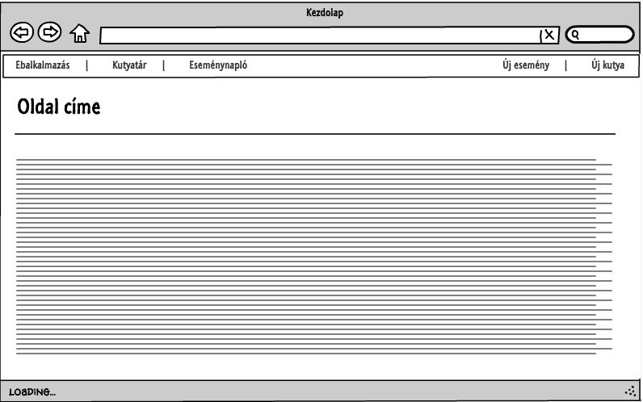
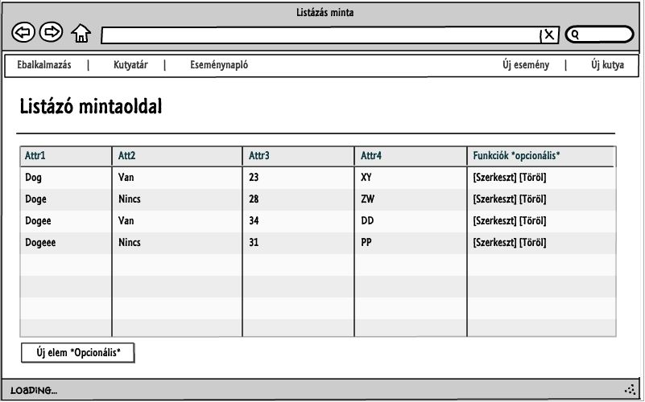

# Ebalkalmazás megvalósítása Ember JS és REST Api használatával
Alk. fejl. beadandó Episode III: A vizsgaidőszak bosszúja

#Feladatkiírás
Egy webes vastagkliens, azaz egyoldalas alkalmazás készítése Ember.js segítségével az utolsó beadandó. Feladatot illetően lehet a szerveroldali alkalmazásnak egy kliensoldali változata, de másik feladat is választható. A feladatnak mininálisan tartalmaznia kell:
*legalább két modellt, egy-sok kapcsolatban
*legalább 1 űrlapot
*legalább 1 listázó oldalt
*legyen lehetőség új felvételére
*legyen lehetőség meglévő szerkesztésére
*legyen lehetőség meglévő törlésére
*REST API végpont kialakítása
*szerveroldali perzisztálás fájlba

A formai követelményeknek megfelelően kell elkészíteni, dokumentálni és közzétenni. Az órai gyakorlatnak megfelelően ez új workspace-ek létrehozását jelenti Cloud9 oldalon, és a Github-on is külön kódtárba dolgozzunk. A dokumentációval kapcsolatos elvárások a formai követelményeknél írtaknak megfelelő (minden kell). A Heroku-n való közzététel opcionális.

##Követelményanalízis

1. Követelmények összegyűjtése:
 * Funkcionális elvárások:
    * lehessen listázni az eseményeket
    * lehessen listázni a kutyákat
    * lehessen új kutyát létrehozni
    * lehessen új eseményt rögzíteni már létező kutyához
    * lehessen eseményt törölni
    * lehessen eseményt szerkeszteni
 * Nem funkcionális követelmények
    * tartalmazzon két modellt, egy-sok kapcsolatban
    * perzisztálás fájlba, vagy adatbázisba történjen
2. Szakterületi fogalomjegyzék: nincsenek speciális fogalmak az alkalmazásban.
3. Használatieset-modell
  * Szerepkörök: 
    * látogató: aki az oldalra tévedt
  * Használati eset diagram:
  * 
  * Folyamatok menete:
    * kutya rögzítése
      * lépések
         1. a látogató az új kutya gombra kattint
         2. a weboldal megjeleníti az űrlapot
         3. a felhasználó módosítja a kívánt mezőket
         4. megnyomja a rögzítés gombot
         5. a rendszer elmenti a változtatásokat
    * esemény rögzítése
      1. A felső menüsorból
         * lépések
            1. a látogató az új esemény gombra kattint
            2. a weboldal megjeleníti az űrlapot
            3. a felhasználó módosítja a kívánt mezőket
               1. Kiválaszt egy kutyát, amelyhez hozzárendeli az eseményt
            4. megnyomja a rögzítés gombot
            5. a rendszer elmenti a változtatásokat
      2. Az eseménynaplón keresztül
         * lépések
            1. a látogató az eseménynapló oldalon rákattint az esemény rögzítése gombra
            2. lásd a felső menüsor 2. lépésétől

##Tervezés

###1. Architektúra terv
####Oldaltérkép:
- főoldal
- kutyatár
- eseménynapló
  * szerkesztés
  * törlés
  * új esemény rögzítése
- új esemény
- új kutya

####Route URL végpontok:
* /: főoldal
* /dogs/list: kutyák listája
* /dogs/new: új kutya hozzáadása
* /myevents/list: események listája
* /myevents/new: új esemény hozzáadása
* /myevents/edit/:id: esemény szerkesztése

### 2. Felhasználóifelület-modell

### 3. Osztálymodell
  * Adatmodell és adatbázisterv
  * 

##Implementáció

+ Fejlesztői környezet
  + Cloud9 IDE
+ Könyvtárstruktúra
+ alkfejlbead
  + app: 
    + app.js:    az alkalmazás
    + router.js: végpontok kialakítása
    + pods: ember.js podok 
      + components: (funkciók logikája / templatek)
      + dog: kutya modellje
      + dogs
         + new: új kutya template-je
         + list: kutya listázás template-je
      + index: kezdőlap template
      + myevent: esemény modellje
      + myevents
         + new: új esemény template-je
         + edit: eseményszerkesztés template-je
         + list: eseménylistázás template-je
    + styles: stíluslapok
  + templates: fő template az alkalmazáshoz
  + config: ember.js konfigurációja

##Felhasználói Dokumentáció
+ Ajánlott konfiguráció
  + 2 magos processzor, 4 GB memória, Grafikus felülettel rendelkező operációs rendszer (pl. Windows 7+, GNU/Linux Ubuntu GNOME)
  + Internetelérés
+ Ajánlott szoftver
  + EcmaScript 5+ Kompatibilis böngésző (pl. Chrome 47+)

+ Az alkalmazás használata:
  + A főoldalról elérhető a kutyák-, események listája, valamint az új kutya-, esemény menüpontok
  + Kutyák listázása
    + A felhasználó az alkalmazáson belül bármikor rákkatinthat a 'Kutyatár' gombra, melynek hatására megjelenik egy táblázat az adatokkal  
  + Események listázása
    + A felhasználó az alkalmazáson belül bármikor rákkatinthat a 'Eseménynapló' gombra, melynek hatására megjelenik egy táblázat az adatokkal
      + Szerkesztés: Ha elérhető esemény, akkor a táblázat adott sorában a 'Szerkesztés' gombra kattintva megjelenik egy űrlap
      + Törlés: Ha elérhető esemény, akkor a táblázat adott sorában a 'Törlés' gombra kattintva azonnal törlődik a rekord
      + Új esemény: A táblázat alatt elérhető 'Új esemény' gombra kattintva megjelenik egy űrlap
   + Új kutya
      + A felső menüsorban a gombra kattintva megjelenik egy űrlap, melyben a kutya becenevének kitöltése kötelező
   + Új esemény
      + Minden mező kitöltése kötelező!
      + Válasszunk egy kutyát, akihez az eseményt hozzárendeljük!

##Tesztelés
Az alkalmazást mintaadatokkal teszteltem a lehetséges tesztesetekre.
Az Ember.JS-ben elérhető teszt funkcióval ES6 kompatibilitási hibákat jelzett.